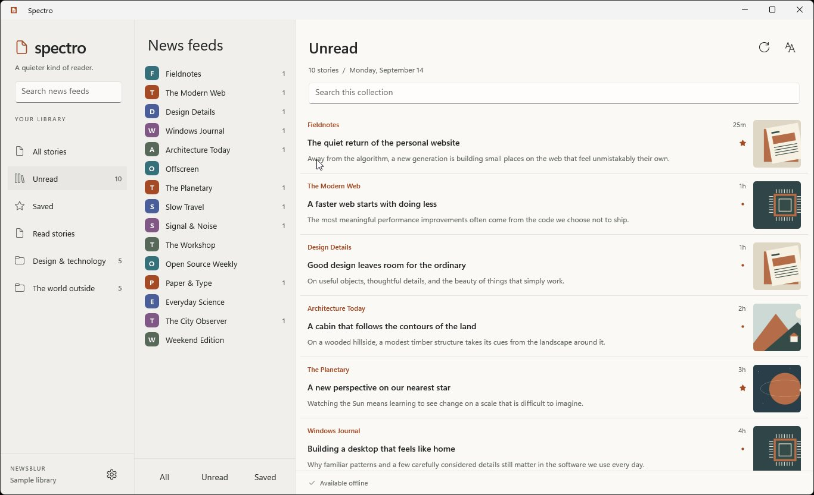
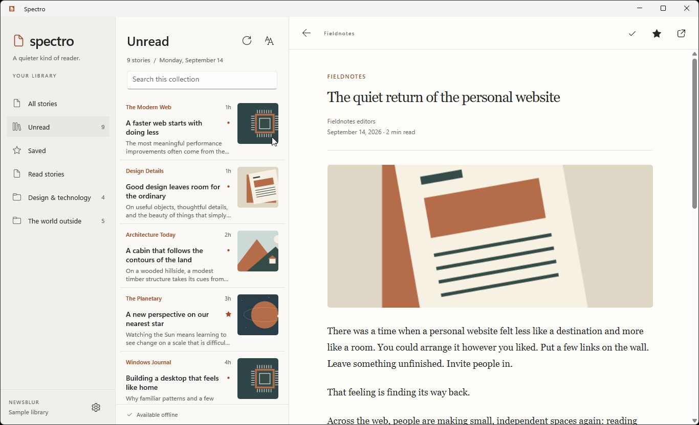
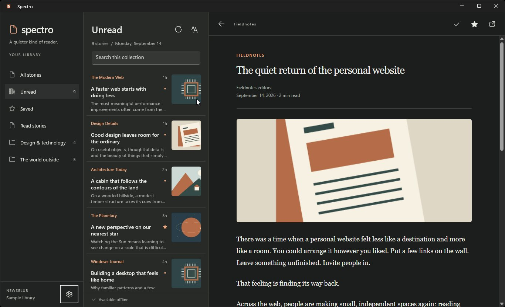

# Spectro

Spectro is becoming a polished, offline-first NewsBlur client for Windows 11.
The application is being built with WinUI 3, SQLite, and .NET Native AOT for
x64 and ARM64. It is **pre-release**, not yet certified for Store submission.

## Visual checkpoints

The library restores separate collection, feed, and story panes, searchable
subscriptions, read/unread/saved filters, preview images, and local unread counts.
The reader adds a restrained toolbar, serif article typography, cached cover
images, reading preferences, and coordinated light/dark appearance.







Additional captures: [reference-sized library](images/library-reference-size-winui.jpg),
[compact reader](images/reader-compact-winui.jpg), and
[normal sign-in](images/onboarding-winui.jpg).

These are captures of the running WinUI application with an isolated sample
library and original sample illustrations, not mockups or a live NewsBlur account.
The original design reference is preserved below; the redesign is not a
pixel-identical copy and does not add the legacy social/global timelines.

<details>
<summary>Original Spectro visual reference</summary>


</details>

The production application lives in `src/Spectro.App`. The former UWP, Realm,
Fody, and compatibility-shim implementation has been removed.

## Install a test build

PR CI produces `spectro-win-x64-msix` and `spectro-win-arm64-msix` artifacts.
Extract the appropriate ZIP, explicitly trust its public test certificate,
then install the signed MSIX and launch Spectro from Start. These are
**self-signed test builds**, not Store releases. The x64 CI job verifies
installation and activation before uploading its artifact.
See [installation and certificate instructions](docs/installing-test-builds.md).
Loose Native AOT executables are not an installation method.

## Build

Prerequisites:

- .NET SDK selected by `global.json`
- WinApp CLI 0.6 or newer
- Visual C++ build tools for the target architecture
- Windows Developer Mode

Build the WinUI 3 app:

```powershell
dotnet build src\Spectro.App\Spectro.App.csproj -c Debug -p:Platform=x64 -t:Rebuild
```

Run the packaged app:

```powershell
winapp run src\Spectro.App\Spectro.App.csproj --arch x64 --debug-output
```

Run deterministic tests:

```powershell
dotnet test src\NewsBlurSharp.TestsCore\NewsBlurSharp.TestsCore.csproj -c Release
dotnet test src\Spectro.ViewModels.Tests\Spectro.ViewModels.Tests.csproj -c Release
dotnet test src\Spectro.Infrastructure.Tests\Spectro.Infrastructure.Tests.csproj -c Release
dotnet test src\Spectro.Sync.Tests\Spectro.Sync.Tests.csproj -c Release
```

Publish the x64 Native AOT release from an x64 Native Tools command prompt
(or after loading Visual Studio's `vcvarsall.bat amd64` in the same process):

```powershell
dotnet publish src\Spectro.App\Spectro.App.csproj -c Release -p:Platform=x64 -r win-x64 --self-contained true
```

Debug builds expose deterministic demo data only when explicitly launched with
`--demo` or with `SPECTRO_DEMO=1`. Release builds do not compile the demo path.
Normal launches always require a real NewsBlur session and never contain test
credentials.
The sample library uses a separate `spectro-demo.db` and settings container;
resetting or refreshing it does not modify the normal account database.

## Reading and privacy

Feed search filters subscriptions. Story search filters the current downloaded
collection. Opening an unread story marks it read locally without closing its
article when it leaves the Unread list. The article toolbar and context menu
provide read/save actions; Ctrl+R, Ctrl+Shift+M, Ctrl+Shift+S, Ctrl+O, and Ctrl+D
also work while the embedded reader has focus.

Preview images are downloaded during sync with a separate, credential-free HTTPS
client and kept in a bounded local bitmap cache. Settings can disable new image
downloads. The reader uses sanitized HTML from a local virtual host (including
articles larger than WebView2's inline HTML limit); opening articles does not
load remote scripts, frames, or images. See [the privacy policy](PRIVACY.md).

Release certification, real-account acceptance, ARM64 publication, and the full
device/DPI matrix remain release gates in [the checklist](docs/release-checklist.md).

The WinUI application uses an explicit, reflection-free composition root in
`src\Spectro.App\AppComposition.cs`. Views read feeds and stories only through
the SQLite repository; network synchronization updates that repository.

See `docs/migration-inventory.md` for the UWP, Realm, WinUI 3, SQLite, and
Native AOT replacement boundary.

## Codex CI/CD for GitHub Issues

This repository includes a dedicated GitHub Actions workflow at `.github/workflows/codex.yml` to let Codex work directly from GitHub issues.

### Setup
1. Add a repository secret named `OPENAI_API_KEY` with an API key that can run Codex.
2. In GitHub, add the `codex` label (optional, but recommended).

### Triggers
The Codex workflow runs when:
- an issue is labeled `codex`,
- a new issue comment contains `@codex`, or
- the workflow is started manually via **workflow_dispatch**.
