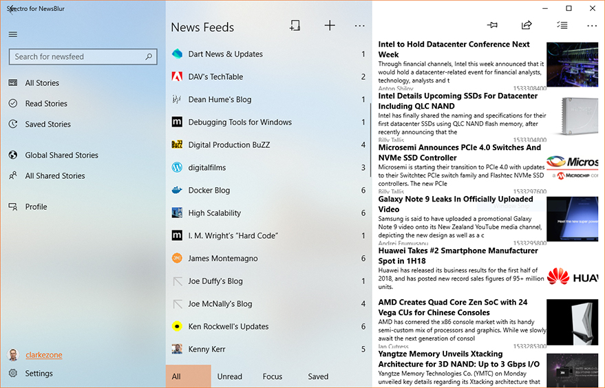

# Spectro
Spetro is a Fluent Design client for the NewsBlur (http://newsblur.com) service for Windows 10.

Currently looking for a new maintainer for this project, please message me on twitter at @clarkezone if you are interested.

## Codex CI/CD for GitHub Issues

This repository includes a dedicated GitHub Actions workflow at `.github/workflows/codex.yml` to let Codex work directly from GitHub issues.

### Setup
1. Add a repository secret named `OPENAI_API_KEY` with an API key that can run Codex.
2. In GitHub, add the `codex` label (optional, but recommended).

### Triggers
The Codex workflow runs when:
- an issue is labeled `codex`,
- a new issue comment contains `@codex`, or
- the workflow is started manually via **workflow_dispatch**.

